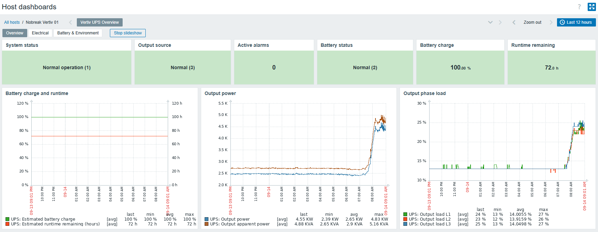

# Vertiv by SNMP

[](https://github.com/kmansur/zabbix-vertiv-ups-snmp/actions/workflows/ci.yml)
[](https://github.com/kmansur/zabbix-vertiv-ups-snmp/actions/workflows/security.yml)
[](LICENSE)

**English** | [Português (Brasil)](README.pt-BR.md)

Zabbix template for read-only monitoring of **Vertiv/Liebert UPS systems via SNMP**. It combines the standard RFC 1628 UPS-MIB with Vertiv/Liebert enterprise OIDs to monitor power source, battery, electrical input/output, bypass, alarms, environmental data, power-quality counters, diagnostic/self-test status and device identification.

## Release status

- **Latest stable release:** `1.4.1`
- **Current repository candidate:** `1.5.0`
- **Field homologation:** in progress

The `main` branch is the active development/candidate branch. **Production users should install a tagged GitHub Release**, not assume the current `main` tree is the latest stable release. Candidate 1.5.0 must pass the documented field-homologation gate before it is tagged stable.

See [project status](docs/en/project-status.md), [production readiness](docs/en/production-readiness.md) and [versioning](docs/en/versioning.md).

## Dashboard preview

<p align="center">
  <a href="docs/en/dashboard.md">
    
  </a>
</p>

Detailed dashboard interpretation: [docs/en/dashboard.md](docs/en/dashboard.md).

## Compatibility

| Zabbix | Template | Status |
| --- | --- | --- |
| 7.0 | `templates/7.0/vertiv-by-snmp.yaml` | Candidate export is CI import-tested; device-specific OIDs must still be validated on the target UPS |
| 8.0 | `templates/8.0/vertiv-by-snmp.yaml` | Preview compatibility export; semantic parity is checked, runtime/import validation is still required |

See the [compatibility matrix](docs/en/compatibility.md).

## Monitoring coverage

- UPS and management-card identification;
- dedicated SNMP heartbeat and management-agent restart notice;
- global UPS status and output source;
- active alarm count plus RFC1628 active-alarm discovery;
- battery status, charge, runtime, voltage and field-validated private current;
- RFC1628 diagnostic-test result monitoring (read-only);
- battery test metadata, discharge count and low-battery warning time;
- input/output/bypass discovery through RFC1628 LLD;
- fixed electrical summary values for deterministic dashboards;
- standardized output-line load alerts;
- input quality counters including line-bad, blackout and brownout counts;
- output real/apparent power and energy counters;
- inlet air temperature and operating time;
- nominal electrical configuration;
- optional Vertiv enterprise SNMP trap collection, disabled by default.

The template is intentionally **read-only**. Reboot, shutdown, outlet control, test-start and other SNMP write/control operations are not included.

## Important production behavior

The field-homologated card used during development implements only part of RFC1628. `upsBatteryCurrent` and `upsBatteryTemperature` return `noSuchObject` on that card/firmware and are therefore retained **disabled by default** for compatibility with other devices.

The Vertiv private battery-temperature object also produced an unreliable/sentinel-like value on the test device, so **no default battery-temperature trigger is active in candidate 1.5.0**. Battery-temperature macros remain reserved for compatibility/future profiles but do not enable alerting by themselves.

Load alerts use standardized RFC1628 `upsOutputPercentLoad` discovery prototypes; the private aggregate `vertiv.output.load` item does not drive default production triggers.

## Quick start

### Production

1. Open the repository **Releases** page and download the latest stable tagged release.
2. Configure SNMP on the Vertiv/Liebert management card; prefer SNMPv3 when supported.
3. In Zabbix, create/select the UPS host and configure its SNMP interface.
4. Import the release YAML for the target Zabbix version.
5. Link **Vertiv by SNMP** to the host.
6. Review **Monitoring → Latest data** and compare values with the UPS LCD/web interface.
7. Tune runtime, charge, load and inlet-temperature thresholds for the site.

### Candidate/development testing

Files under `templates/` on `main` represent the current repository candidate and may be newer than the latest stable release. Use them only when intentionally testing the candidate.

Detailed instructions: [docs/en/installation.md](docs/en/installation.md).

## Default and reserved thresholds

| Macro | Default | Purpose |
| --- | ---: | --- |
| `{$UPS.RUNTIME.WARN}` | 10 min | Low runtime warning |
| `{$UPS.RUNTIME.CRIT}` | 5 min | Critical runtime |
| `{$UPS.BATTERY.CHARGE.WARN}` | 40% | Low charge while on battery |
| `{$UPS.BATTERY.CHARGE.CRIT}` | 20% | Critical charge while on battery |
| `{$UPS.LOAD.WARN}` | 80% | RFC1628 output-line load warning |
| `{$UPS.LOAD.CRIT}` | 95% | RFC1628 output-line load critical |
| `{$UPS.INLET.TEMP.WARN}` | 30 °C | High inlet temperature |
| `{$UPS.INLET.TEMP.CRIT}` | 35 °C | Critical inlet temperature |
| `{$UPS.BATTERY.TEMP.WARN}` | 35 °C | Reserved; not used by a default 1.5.0 production trigger |
| `{$UPS.BATTERY.TEMP.CRIT}` | 40 °C | Reserved; not used by a default 1.5.0 production trigger |

See [configuration and macros](docs/en/configuration.md).

## Repository layout

```text
.github/                 GitHub Actions, issue templates and PR template
docs/
├── en/                  English documentation
├── images/              Dashboard screenshots
└── pt-BR/               Brazilian Portuguese documentation
templates/
├── 7.0/                 Zabbix 7.0 export
└── 8.0/                 Zabbix 8.0 preview export
tests/                   Validator tests
tools/                   Validation and helper tools
```

## Development and validation

```sh
python -m pip install -r requirements-dev.txt
python -m compileall -q tools tests
ruff check tools tests
ruff format --check tools tests
pytest -q
python tools/validate_templates.py
python tools/validate_docs.py
python tools/validate_production.py
```

CI also performs a real Zabbix 7.0 API import/upgrade test. See [CONTRIBUTING.md](CONTRIBUTING.md).

## Documentation

- [Overview](docs/en/README.md)
- [Installation](docs/en/installation.md)
- [Configuration and macros](docs/en/configuration.md)
- [Metrics and OIDs](docs/en/metrics.md)
- [Electrical summary](docs/en/electrical-summary.md)
- [Dashboard](docs/en/dashboard.md)
- [Triggers](docs/en/triggers.md)
- [SNMP architecture](docs/en/snmp.md)
- [Troubleshooting](docs/en/troubleshooting.md)
- [Compatibility matrix](docs/en/compatibility.md)
- [Production readiness/homologation](docs/en/production-readiness.md)
- [MIB/OID provenance](docs/en/mib-sources.md)
- [Versioning](docs/en/versioning.md)
- [License and attribution](docs/en/license-attribution.md)

Brazilian Portuguese documentation is under [docs/pt-BR/](docs/pt-BR/README.md).

## Versioning

Project releases use Semantic Versioning `X.Y.Z`. Zabbix `vendor.version` uses the equivalent `X.Y-Z` representation.

```text
VERSION / Git tag / GitHub Release: X.Y.Z
Zabbix vendor.version: X.Y-Z
```

Candidate `1.5.0` is therefore exported as `vendor.version: 1.5-0`.

## License and attribution

Original work in this repository is distributed under the **MIT License**.

This project credits the original **Template Vertiv** by **Mihguel da Silva Santos Tavares de Araujo** as a structural and historical reference:

https://github.com/Mihguel-Araujo/Template-Zabbix/blob/main/Template%20Vertiv

No explicit license was found in the referenced repository at the time of review, therefore the original file is not redistributed here and is not relicensed by this project.

See [LICENSE](LICENSE), [NOTICE.md](NOTICE.md) and [docs/en/license-attribution.md](docs/en/license-attribution.md).

Maintained by **Karim Mansur / Net Tech**.
