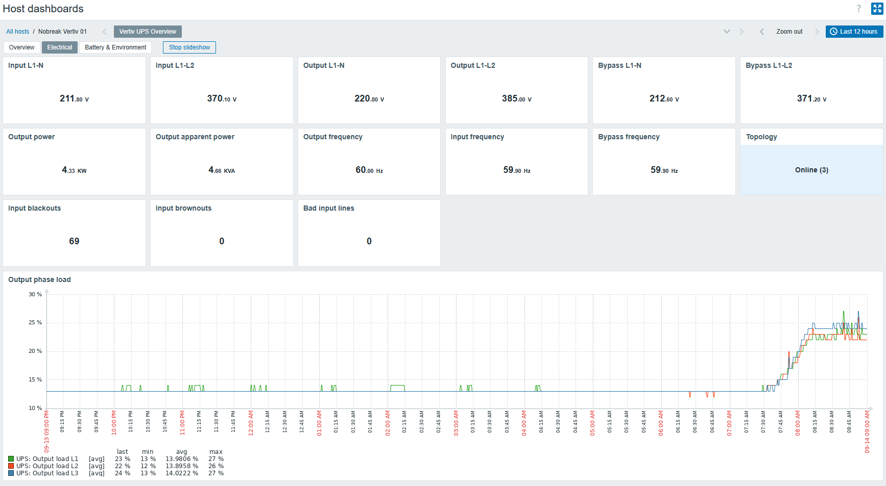
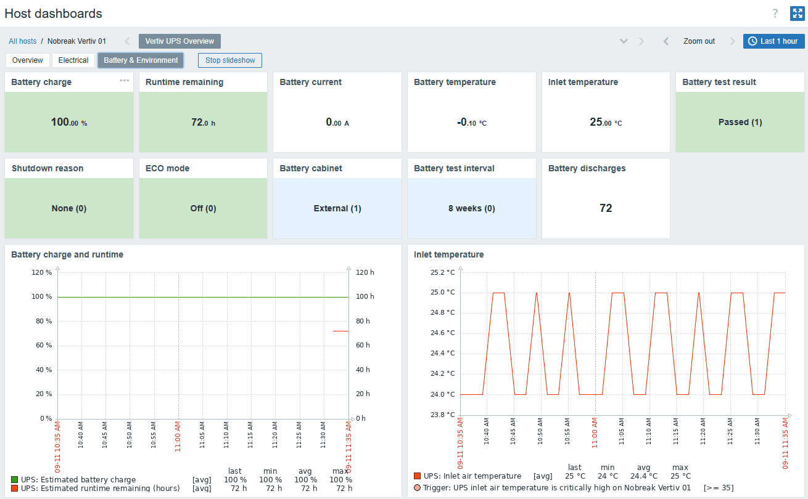

# Dashboard nativo

[English](../en/dashboard.md)

O dashboard de template **Vertiv UPS Overview** é importado junto com o template e acompanha automaticamente o host monitorado. As imagens abaixo foram capturadas de um nobreak Vertiv real utilizando o dashboard da versão 1.4.1 enquanto o equipamento estava em operação normal/online. Os valores são apenas exemplos; tensão, carga, autonomia e temperatura variam conforme o modelo do nobreak, banco de baterias e carga conectada.

> **Nota da candidata 1.5.0:** durante a homologação, a placa testada retornou `noSuchObject` para `upsBatteryCurrent` e `upsBatteryTemperature` da RFC1628. Por isso, esses dois itens padrão ficam desabilitados por default. O card de temperatura de bateria mostrado na captura 1.4.1 foi substituído por **Battery status** na candidata 1.5.0; a corrente continua usando o OID privado Vertiv já validado em campo.

O dashboard é dividido propositalmente em três páginas:

- **Overview** — saúde operacional, bateria, potência de saída e carga por fase em uma única visão.
- **Electrical** — medições detalhadas de entrada, saída e bypass, além de contadores cumulativos de qualidade de energia.
- **Battery & Environment** — bateria, autonomia, teste/configuração e temperatura ambiente.

O dashboard utiliza apenas itens e gráficos de monitoração somente leitura já fornecidos pelo template. Nenhuma operação SNMP de escrita/controle é introduzida.

## Cores dos cards de status

Os cards utilizam fundos suaves para tornar mudanças de estado visíveis sem poluir a tela:

- **Verde** — estado normal/saudável.
- **Amarelo** — atenção ou estado não normal que deve ser verificado.
- **Laranja** — condição degradada ou alerta mais forte.
- **Vermelho** — falha/estado crítico.
- **Azul-claro / neutro** — informação ou configuração, e não necessariamente condição de saúde.

Os cards com enums mantêm a renderização nativa do value map do Zabbix, por exemplo `Normal (3)` ou `Passed (1)`. Isso preserva a semântica numérica usada por triggers e thresholds, mantendo ao mesmo tempo um rótulo legível.

## Overview

A página Overview deve ser o primeiro ponto de consulta tanto em operação normal quanto durante um incidente. A primeira linha responde rapidamente a seis perguntas: o nobreak está saudável? De onde a carga está sendo alimentada? Há alarmes ativos? A bateria está saudável? Está carregada? Qual é a autonomia estimada?

### System status, Output source e alarmes

- **System status** deve normalmente permanecer verde e indicar `Normal operation`.
- **Output source** deve normalmente indicar `Normal`. Uma mudança para Battery ou Bypass é operacionalmente importante mesmo que a carga continue alimentada.
- **Active alarms** representa a quantidade de alarmes UPS-MIB atualmente informados. Zero é o estado esperado em condição saudável. Na candidata 1.5.0, qualquer valor positivo recebe destaque crítico; a quantidade não é usada para inferir severidade.
- **Battery status** deve normalmente indicar `Normal`.
- **Battery charge** mostra a estimativa de carga da bateria.
- **Runtime remaining** é uma conversão para horas, feita apenas para apresentação, do valor RFC1628 originalmente informado em minutos. O item bruto continua em minutos para a lógica das triggers.

### Battery charge and runtime

Esse gráfico utiliza duas escalas diferentes:

- **Eixo esquerdo:** carga da bateria em percentual.
- **Eixo direito:** autonomia estimada em horas.

Durante operação normal pela rede elétrica, com a bateria carregada, as duas linhas podem permanecer praticamente retas. Durante uma falta de energia real ou teste de bateria, carga e autonomia devem diminuir enquanto o nobreak sustenta a carga.

Como interpretar:

- Uma redução gradual durante operação por bateria é esperada.
- Uma queda brusca de autonomia pode ocorrer após grande aumento de carga ou após o nobreak recalcular sua estimativa.
- A autonomia pode cair mesmo com percentual de carga ainda alto, pois a autonomia depende fortemente da carga instantânea, enquanto o percentual representa uma estimativa do estado energético da bateria.
- A autonomia é uma estimativa fornecida pelo nobreak, e não uma garantia de tempo de operação. Na imagem de exemplo, o equipamento informa aproximadamente 72 horas; esse valor vem do próprio nobreak e deve ser analisado de acordo com a carga atual e a configuração do banco de baterias.

### Output power

O gráfico apresenta:

- **Output power (kW):** potência ativa/real efetivamente consumida pela carga.
- **Output apparent power (kVA):** capacidade elétrica aparente exigida do nobreak.

Normalmente, a potência aparente é igual ou superior à potência ativa. A diferença entre kW e kVA está relacionada ao fator de potência agregado da carga.

Como interpretar:

- Uma curva suave representa carga relativamente estável.
- Degraus para cima normalmente indicam equipamentos ligados ou aumento de demanda.
- Degraus para baixo podem indicar retirada de carga ou desligamento inesperado.
- Crescimento sustentado em direção à capacidade nominal do nobreak merece atenção mesmo antes de um alarme de sobrecarga.
- Uma separação crescente entre kW e kVA pode indicar piora do fator de potência agregado ou mudança no perfil da carga.

### Output phase load

Esse gráfico mostra o percentual de carga de saída em L1, L2 e L3.

Como interpretar:

- Em uma instalação trifásica equilibrada, as três linhas devem permanecer razoavelmente próximas.
- Pequenas diferenças momentâneas são comuns quando equipamentos ligam, desligam ou alteram consumo.
- Diferença persistente de uma fase em relação às demais indica desbalanceamento de carga e deve ser investigada.
- Uma fase se aproximando dos thresholds configurados de carga é mais importante que apenas observar a média total.

Na imagem de exemplo, as três fases permanecem aproximadamente na faixa dos 20 e poucos por cento, indicando uma condição bem equilibrada.

## Electrical

A página Electrical é voltada à validação do caminho elétrico e troubleshooting.

### Cards de tensão

O dashboard apresenta valores representativos fase-neutro e fase-fase para entrada, saída e bypass:

- **Input L1-N / L1-L2** — tensão da rede/entrada.
- **Output L1-N / L1-L2** — tensão entregue à carga protegida.
- **Bypass L1-N / L1-L2** — tensão do caminho alternativo disponível para o nobreak.

Em um sistema trifásico equilibrado, a tensão fase-fase é aproximadamente √3 vezes a tensão fase-neutro. Os valores da imagem de exemplo estão coerentes com essa relação. Grandes diferenças entre fases, degraus bruscos ou indisponibilidade do bypass merecem investigação.

### Cards de potência e frequência

- **Output power** e **Output apparent power** resumem instantaneamente a demanda da carga.
- **Output frequency**, **Input frequency** e **Bypass frequency** devem normalmente permanecer próximas da frequência nominal do local.
- **Topology** apresenta a classe de operação informada pelo nobreak Vertiv; o equipamento de exemplo informa `Online`.

Diferença persistente entre frequência de entrada e saída, frequência de entrada instável ou bypass fora da faixa aceita pode ajudar a explicar eventos de transferência ou indisponibilidade do bypass.

### Contadores de qualidade de energia

Os cards **Input blackouts**, **Input brownouts** e **Bad input lines** são contadores cumulativos. Eles não representam alarmes ativos no momento.

Como interpretar:

- `68` blackouts significa que o nobreak acumulou 68 eventos de falta de entrada durante a vida/período de reset do contador; isso **não** significa que existem 68 quedas ativas agora.
- Brownouts contabiliza eventos de subtensão/sag conforme expostos pelo equipamento.
- Bad input lines representa a informação de linhas ruins da UPS-MIB e deve normalmente permanecer em zero em uma fonte saudável.
- O sinal mais útil normalmente é um **incremento** do contador. Em um incidente recente, compare o valor atual com o valor anterior.

Esses contadores são mostrados como cards, e não como gráficos, porque um contador cumulativo tende a produzir uma linha quase reta ou em degraus e pode induzir a uma interpretação errada como visão operacional de eventos.

### Output phase load — visão em largura total

O gráfico em largura total é a mesma visão L1/L2/L3 exibida em Overview, porém com mais espaço horizontal para análise. Ele é útil para ampliar a janela de tempo de um incidente e identificar desbalanceamento persistente ou alterações específicas em uma fase.

## Battery & Environment

Essa página concentra saúde da bateria, configuração/teste e temperatura ambiente. A captura acima é da 1.4.1; na candidata 1.5.0 o antigo card **Battery temperature** é substituído por **Battery status** após a constatação de campo de que a placa não implementa `upsBatteryTemperature`.

### Cards de bateria e status

- **Battery charge** — percentual estimado de carga.
- **Runtime remaining** — autonomia estimada em horas para apresentação.
- **Battery current** — corrente entrando/saindo da bateria pelo OID privado Vertiv `...4149`, validado no equipamento de homologação.
- **Battery status** — estado padronizado RFC1628 (`upsBatteryStatus`), suportado pela placa testada.
- **Inlet temperature** — temperatura do ar de entrada/ambiente do nobreak.
- **Battery test result** — resultado do teste de bateria mais recente.
- **Shutdown reason** — motivo de shutdown informado pelo equipamento.
- **ECO mode** — estado do modo ECO.
- **Battery cabinet** — tipo de gabinete/banco detectado ou configurado.
- **Battery test interval** — intervalo configurado do autoteste.
- **Battery discharges** — quantidade cumulativa de eventos de descarga da bateria.

`Battery discharges` é um contador histórico. Ele não representa quantidade de baterias nem número de descargas acontecendo simultaneamente.

### Corrente e temperatura de bateria: compatibilidade real

A candidata 1.5.0 inicialmente adicionou os escalares RFC1628 `upsBatteryCurrent` e `upsBatteryTemperature` para ampliar portabilidade. A homologação mostrou que a placa do ITA-20kVA testado responde `No Such Object available on this agent at this OID` para ambos.

A política final da candidata é:

- `ups.battery.current` e `ups.battery.temperature` permanecem no template, mas **desabilitados por padrão**, sem triggers e fora do dashboard;
- `vertiv.battery.current` (`...4149`) continua sendo a corrente apresentada, pois funciona no equipamento validado;
- `vertiv.battery.temperature` (`...4156`) permanece desabilitada porque retornou aproximadamente `-0,1 °C`, valor incompatível com o ambiente observado;
- não existe trigger padrão de temperatura de bateria até um OID/sensor de temperatura ser comprovadamente suportado e validado;
- a monitoração ambiental padrão utiliza **Inlet temperature**.

Isso evita tanto `Unsupported item` quanto alertas baseados em valor de sensor inválido, sem remover compatibilidade com outras placas que possam implementar os escalares RFC1628 opcionais.

### Inlet temperature

O gráfico utiliza somente a temperatura do ar de entrada, que foi a métrica ambiental considerada útil e coerente no equipamento validado em campo.

Como interpretar:

- Observe primeiro os valores numéricos do eixo Y. O Zabbix ajusta automaticamente a escala, portanto uma variação de 24 °C para 25 °C pode parecer visualmente grande apesar de representar somente 1 °C.
- Uma faixa estreita e estável é normal.
- Uma tendência contínua de alta é mais importante que uma amostra isolada.
- Linhas de warning/critical exibidas no gráfico vêm das triggers/macros configuradas no template; adapte os limites ao ambiente da sala e às recomendações do fabricante, em vez de tratar valores padrão como limites universais.

### Battery charge and runtime — visão dedicada

O mesmo gráfico de dois eixos exibido no Overview é repetido nesta página para permitir análise de bateria sem necessidade de alternar de tela. Ao investigar descarga, recarga ou teste de bateria, amplie o período do dashboard para incluir o intervalo anterior e posterior ao evento.

## Por que não há mais gráficos no dashboard padrão

A versão 1.4.1 e a candidata 1.5.0 mantêm propositalmente um conjunto pequeno de gráficos. Os gráficos atuais respondem às principais perguntas operacionais sem duplicar cada item numérico como tendência permanente.

Tensões e frequências de entrada/saída/bypass continuam armazenadas no histórico e podem ser abertas em gráfico pelo Latest data durante investigação de qualidade de energia. Elas permanecem como cards no dashboard padrão porque, em operação normal, tendem a ser estáveis e adicionar vários gráficos permanentes aumentaria a poluição visual.

Os OIDs privados Vertiv de potência de entrada por fase também não são destacados no dashboard porque a escala SNMP deles ainda não foi validada entre modelos/firmwares. O projeto evita apresentar um gráfico aparentemente confiável enquanto essa escala não estiver confirmada em campo.

## Ordem recomendada de leitura durante um incidente

1. Verifique **System status**, **Output source** e **Active alarms**.
2. Verifique **Battery status**, **Battery charge** e **Runtime remaining**.
3. Observe **Output power** procurando mudanças bruscas de carga.
4. Observe **Output phase load** procurando sobrecarga ou desbalanceamento.
5. Abra **Electrical** e compare tensão/frequência de entrada, saída e bypass.
6. Verifique se os contadores de blackout/brownout aumentaram.
7. Abra **Battery & Environment** e confira corrente de bateria, temperatura de entrada, resultado do teste de bateria e motivo de shutdown.
8. Amplie a janela de tempo do dashboard para incluir o período anterior e posterior ao incidente.

## Notas de validação em campo

O dashboard foi validado em campo com uma placa/nobreak Vertiv que retorna enums privados como strings, incluindo `Normal Operation`, `Online`, `Passed` e `External`. O template normaliza essas respostas para valores numéricos canônicos, permitindo que value maps, triggers e cores dos cards permaneçam consistentes.

A mesma homologação comprovou que o agente implementa a UPS-MIB de forma parcial: suportar `upsBatteryStatus`, autonomia e outros objetos RFC1628 não significa necessariamente suportar `upsBatteryCurrent` ou `upsBatteryTemperature`.

O item RFC1628 bruto de autonomia continua sendo a fonte autoritativa para cálculos de trigger. O item `ups.battery.runtime.hours` existe somente para tornar a apresentação do dashboard mais didática.
